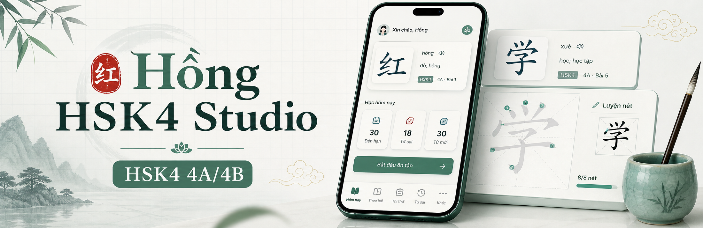
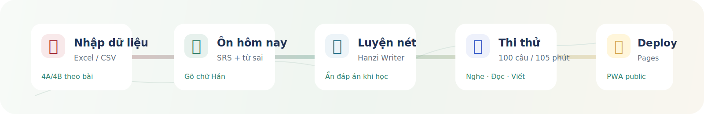
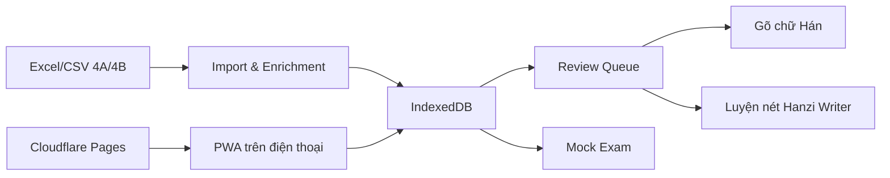

<p align="center">
  
</p>

<h1 align="center">Hồng HSK4 Studio</h1>

<p align="center">
  Mobile-first PWA cho người Việt ôn HSK4 4A/4B theo bài, gõ chữ Hán, luyện nét và thi thử theo cấu trúc HSK4 cũ.
</p>

<p align="center">
  <a href="https://hsk4.holilihu.online/"></a>
  <a href="https://github.com/meiiie/hong_hsk/actions/workflows/ci.yml"></a>
  
  
</p>

<p align="center">
  
</p>

## Vì Sao Có Dự Án Này

Hồng cần ôn HSK4 trên máy tính và điện thoại trong thời gian ngắn, nhưng Excel bắt đầu vướng ở ba điểm: khó tự chấm chữ Hán, khó gom lại từ sai, và khó mô phỏng cảm giác thi trên màn hình. App này biến file từ vựng thành một PWA học thật: nhập dữ liệu, gõ chữ Hán, lưu lịch sử, tự đẩy từ sai lên trước, luyện nét từng chữ và làm đề thi thử.

Mục tiêu không phải làm một app học tiếng Trung chung chung. Dự án bám vào nhu cầu rất cụ thể:

- Học theo bài 1-20 của giáo trình chuẩn HSK4 4A/4B.
- Ưu tiên nghĩa tiếng Việt, pinyin, ví dụ và trạng thái chất lượng dữ liệu.
- Gõ chữ Hán rồi app tự so đáp án, giữ nguyên chữ đã gõ và phản hồi xanh/đỏ.
- Ôn từ sai và từ đến hạn theo lịch giãn cách.
- Thi thử HSK4 cũ: 100 câu, 105 phút, ba phần Nghe, Đọc, Viết.

## Demo

- Production: [hsk4.holilihu.online](https://hsk4.holilihu.online/)
- Cloudflare Pages fallback: [hong-hsk4-studio.pages.dev](https://hong-hsk4-studio.pages.dev/)
- PWA có thể cài lên điện thoại nếu trình duyệt hỗ trợ manifest/service worker.

## Tính Năng Chính

| Nhóm | Hiện có |
| --- | --- |
| Học từ | Hàng đợi hôm nay, theo bài, từ sai, tự chấm chữ Hán |
| Luyện nét | Hanzi Writer, nét mẫu, quiz nét, chế độ ẩn/hiện đáp án phù hợp khi học |
| Ôn giãn cách | Sai ôn lại sớm, đúng liên tiếp tăng khoảng cách, lưu trạng thái trong IndexedDB |
| Dữ liệu | Nhập Excel/CSV, xuất backup, nạp bộ 4A/4B tham khảo, glossary Việt hóa |
| Thi thử | 4 bộ đề mô phỏng, đồng hồ 105 phút, điểm theo Nghe/Đọc/Viết |
| Mobile UX | Bottom nav, vùng bấm lớn, bố cục ưu tiên một hành động chính |
| Deploy | Cloudflare Pages, custom domain, security headers, Docker/nginx fallback |

## Trạng Thái Dữ Liệu

App có thể nạp bộ 4A/4B tham khảo để dựng lộ trình ban đầu. Đây không phải tài liệu chính thức và không thay thế sách/giáo trình có bản quyền.

Các nguyên tắc đang dùng:

- `621` mục: mốc tham khảo từ file Excel ôn 20 bài giáo trình chuẩn HSK4 4A/4B.
- `1.200` từ: mốc HSK4 cũ tính lũy kế, gồm nền HSK1-3 và phần HSK4.
- Nghĩa tiếng Việt tự bổ sung được đánh dấu để duyệt, không xem là bản dịch cuối cùng.
- Thi thử mô phỏng cấu trúc, thao tác và áp lực thời gian; không phân phối đề/audio chính thức.

## Kiến Trúc



Các module chính:

- `src/README.md`: quy tắc DDD-lite/Clean Architecture cho source tree.
- `src/main.ts` và `src/app/hsk-app.ts`: entrypoint mỏng và app shell.
- `src/domain/review/review-policy.ts`: hằng số lịch ôn và thuật toán tăng khoảng cách.
- `src/domain/review/review-service.ts`: chấm đáp án, tạo attempt, xếp hàng học.
- `src/domain/hsk4/hsk4-excel-vocab.ts`: dữ liệu từ vựng HSK4 4A/4B đã nạp.
- `src/infrastructure/hanzi/hanzi-stroke-trainer.ts`: tích hợp Hanzi Writer và dữ liệu nét.
- `src/domain/exam/mock-exam.ts`: sinh đề thi thử HSK4 mô phỏng.
- `src/infrastructure/import-export/workbook-io.ts`: nhập/xuất Excel, CSV, JSON.
- `src/infrastructure/storage/indexeddb-state-store.ts`: IndexedDB/local state.
- `src/presentation/i18n.ts`: nhãn tiếng Việt/Anh.

## Chạy Local

Yêu cầu:

- Node.js 22+
- npm
- Python 3.12+ nếu chạy Playwright harness

```bash
npm ci
npm run dev
```

Mở `http://127.0.0.1:5173/`.

Build production:

```bash
npm run build
```

Kiểm thử đầy đủ:

```bash
python -m pip install -r tests/requirements.txt
python -m playwright install chromium
npm test
```

## Test Harness

`npm test` chạy:

1. Agent/context harness check.
2. Architecture boundary check cho DDD-lite source tree.
3. TypeScript check.
4. Vitest unit test cho review policy, review queue, answer matching và mock exam.
5. Vite production build.
6. Harness Playwright trên desktop và mobile viewport.
7. Kiểm tra luồng học, nút ẩn/hiện đáp án, luyện nét, từ sai, nạp dữ liệu 621 mục và thi thử.

Ảnh kiểm thử được ghi vào `artifacts/` khi chạy local/CI.

Agent và người mới nên bắt đầu từ [AGENTS.md](AGENTS.md), sau đó đọc [docs/agent-context/README.md](docs/agent-context/README.md) để nắm quy tắc làm việc, bản đồ dự án, harness và bước Cloudflare còn lại.

## Deploy

Mỗi push lên `main` sẽ chạy CI trước. Khi workflow `CI` xanh, workflow `Deploy Cloudflare Pages` tự build lại artifact production và deploy `dist` lên Cloudflare Pages.

Deploy thủ công vẫn có thể chạy từ tab Actions nếu cần:

```bash
npm run deploy:cf
```

Để GitHub Actions deploy được, repository cần secrets:

- `CLOUDFLARE_API_TOKEN`
- `CLOUDFLARE_ACCOUNT_ID`

`CLOUDFLARE_API_TOKEN` nên là token hẹp quyền, tối thiểu `Account > Cloudflare Pages > Edit`. Không commit token vào repo.

Custom domain production hiện tại là `hsk4.holilihu.online`.

## Thiết Kế README

README dùng banner tạo bằng Image Gen và một SVG flow nhẹ để thay thế phần mô tả dài. GitHub không chạy JavaScript trong README, nên animation nếu có phải là ảnh/GIF/SVG an toàn, không phụ thuộc script.

Hướng trình bày tham khảo:

- GitHub Docs về README: https://docs.github.com/articles/about-readmes
- GitHub Actions cho Node.js: https://docs.github.com/en/actions/tutorials/build-and-test-code/building-and-testing-nodejs
- web.dev PWA checklist: https://web.dev/pwa-checklist/
- Cloudflare Wrangler Pages deploy: https://developers.cloudflare.com/workers/wrangler/commands/pages/
- Hanzi Writer docs: https://hanziwriter.org/docs.html
- ChineseTest HSK4 structure: https://www.chinesetest.cn/HSK/4
- FSRS/Open Spaced Repetition: https://github.com/open-spaced-repetition

## Ghi Chú Pháp Lý

HSK và giáo trình chuẩn HSK thuộc về các chủ sở hữu tương ứng. Dự án này là công cụ ôn tập cá nhân, không phải sản phẩm chính thức của đơn vị tổ chức kỳ thi và không phân phối nội dung đề/audio chính thức.

## License

Code trong repo phát hành theo MIT License. Dữ liệu, trademark, tài liệu HSK và nội dung tham khảo của bên thứ ba giữ nguyên quyền của chủ sở hữu tương ứng.
