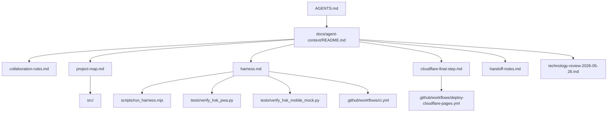

# Agent Context Index

Last updated: 2026-05-26.

This folder is the shared memory layer for Hồng HSK4 Studio. It exists so an AI agent or teammate can join the project without rediscovering the same facts, rules, and deployment caveats every session.

The design follows the practical lesson from Anthropic's large-codebase guidance: a model is only one part of the system; the surrounding harness, context files, checks, tools, and review process determine whether agent work stays reliable.

## Read Order

1. [Root AGENTS.md](../../AGENTS.md): critical rules and high-level commands.
2. [Collaboration Rules](collaboration-rules.md): safe branch/PR workflow for a shared GitHub account.
3. [Project Map](project-map.md): where product, data, review, mock exam, PWA, deploy, and tests live.
4. [Technology Review](../architecture/technology-review-2026-05-26.md): researched stack decision and comparable project notes.
5. [Harness](harness.md): deterministic checks, CI/CD, and local verification matrix.
6. [Cloudflare Final Step](cloudflare-final-step.md): how to finish production deploy secret setup without leaking tokens.
7. [Handoff Notes](handoff-notes.md): current state, unresolved work, and things to re-check.

## Context Graph

## Maintenance Policy

- Keep the root `AGENTS.md` short. Put details here.
- Prefer links over duplicated instructions.
- Update this folder in the same PR as any change to CI/CD, deploy, HSK data policy, module boundaries, or team workflow.
- Run `npm run context:check` before opening a PR.
- Review these files every 3-6 months or after major model/tooling changes.

## Source Notes

- Anthropic Claude Code large-codebase guidance: https://claude.com/blog/how-claude-code-works-in-large-codebases-best-practices-and-where-to-start
- GitHub Actions secrets documentation: https://docs.github.com/en/actions/how-tos/write-workflows/choose-what-workflows-do/use-secrets
- Cloudflare Pages direct upload CI documentation: https://developers.cloudflare.com/pages/how-to/use-direct-upload-with-continuous-integration/
- HSK4 technology review: ../architecture/technology-review-2026-05-26.md
