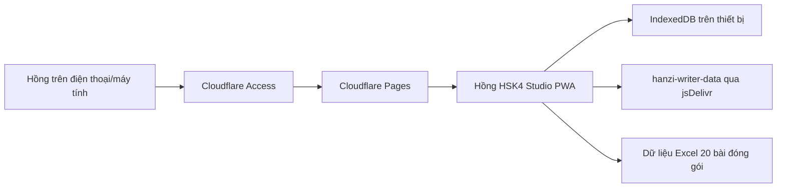

# Hồng HSK4 Studio Deployment Runbook

Ngày chuẩn hóa: 2026-05-25.

## Quyết định triển khai

Với nhu cầu hiện tại chỉ có Hồng sử dụng, phương án chính nên là Cloudflare Pages kèm Cloudflare Access:

- Không cần thuê VM hay quản trị hệ điều hành.
- Phù hợp PWA tĩnh Vite, dữ liệu học nằm trong IndexedDB trên thiết bị của Hồng.
- Có thể chặn truy cập bằng email của Hồng qua Cloudflare Access.
- Chi phí và vận hành thấp hơn GCP VM/Cloud Run cho bài toán một người học.

Docker/nginx trong repo là phương án dự phòng nếu sau này muốn chạy ở GCP Compute Engine, Cloud Run container, VPS, hoặc mạng nội bộ.

Triển khai public hiện tại: https://hsk4.holilihu.online/

URL Pages fallback: https://hong-hsk4-studio.pages.dev/

## Kiến trúc hiện tại



Không thêm backend/SQLite ở giai đoạn này. Với một người dùng, backend chỉ làm tăng chi phí, tăng bề mặt bảo mật và tăng việc vận hành. Nếu sau này cần đồng bộ nhiều thiết bị, khi đó mới thêm API + SQLite/D1 theo domain hiện có.

## Cloudflare Pages

### Chuẩn bị

```bash
npm ci
npm run build
npx wrangler --version
```

`wrangler.jsonc` đã khai báo:

- `name`: `hong-hsk4-studio`
- `compatibility_date`: `2026-05-24`
- `pages_build_output_dir`: `./dist`

Ghi chú: ngày làm việc của team là 2026-05-25 theo giờ Việt Nam, nhưng Wrangler kiểm tra compatibility date theo thời điểm Cloudflare/UTC. Vì vậy cấu hình ghim `2026-05-24`, ngày gần nhất không bị coi là tương lai khi chạy deploy từ máy hiện tại.

### Tạo project lần đầu

```bash
npx wrangler login
npx wrangler pages project create hong-hsk4-studio --production-branch main
```

### CI/CD tự động

Repo GitHub `meiiie/hong_hsk` có hai workflow:

- `CI`: chạy trên pull request, push `main` và thủ công. Workflow này typecheck, build, chạy Playwright harness desktop/mobile và audit dependency.
- `Deploy Cloudflare Pages`: tự chạy sau khi `CI` trên `main` hoàn tất thành công. Workflow checkout đúng commit vừa được CI kiểm tra, build lại `dist`, sau đó chạy `wrangler pages deploy`.

Workflow deploy dùng GitHub Environment `production` với URL `https://hsk4.holilihu.online/` và concurrency `cloudflare-pages-production` để tránh hai deploy production chạy đè nhau.

Secrets cần có trong repository:

```text
CLOUDFLARE_ACCOUNT_ID
CLOUDFLARE_API_TOKEN
```

`CLOUDFLARE_ACCOUNT_ID` đã được set trong GitHub Secrets. `CLOUDFLARE_API_TOKEN` nên tạo trong Cloudflare Dashboard với quyền hẹp nhất đủ dùng:

```text
Account -> Cloudflare Pages -> Edit
```

Sau khi thêm token, mỗi lần push lên `main` sẽ tự deploy nếu CI xanh.

### Deploy thủ công từ máy local

```bash
npm run deploy:cf
```

Hoặc chạy preview gần giống Cloudflare trước khi deploy:

```bash
npm run preview:cf
```

### Bảo vệ chỉ cho Hồng vào

Trong Cloudflare Zero Trust:

1. Vào Access -> Applications -> Add an application.
2. Chọn Pages app hoặc self-hosted app trỏ tới domain Pages/custom domain.
3. Tạo policy `Allow Hong`.
4. Include email của Hồng, ví dụ `hong@example.com`.
5. Chọn phương thức xác thực email OTP hoặc Google.
6. Mở thử bằng tab ẩn danh và xác nhận người ngoài không vào được.

Không đặt mật khẩu trong frontend. Việc chặn người dùng phải nằm ở Cloudflare Access, trước khi PWA được tải xuống trình duyệt.

## Custom domain

Không dùng apex `holilihu.online` cho app này vì domain đó đang phục vụ dự án khác. URL theo brand riêng dùng subdomain tách biệt:

- `hsk4.holilihu.online`
- `hong-hsk4.holilihu.online`

Theo tài liệu Cloudflare Pages, custom subdomain cần được thêm trong Pages project -> Custom domains. Domain `hsk4.holilihu.online` đã được gắn với Pages project `hong-hsk4-studio`. Nếu Cloudflare không tự tạo DNS record, tạo CNAME:

```text
Type: CNAME
Name: hsk4
Target: hong-hsk4-studio.pages.dev
Proxy: Proxied
```

## Security headers

Cloudflare Pages đọc `public/_headers` sau khi build. File này cấu hình:

- CSP chỉ cho script/style/app shell từ chính site.
- Cho phép `connect-src` tới `cdn.jsdelivr.net` để tải dữ liệu nét Hanzi Writer.
- Không cần `connect-src` tới `raw.githubusercontent.com` cho dữ liệu 4A/4B vì bộ mặc định đã được đóng gói trong app.
- Chặn iframe bằng `frame-ancestors 'none'` và `X-Frame-Options: DENY`.
- Tắt quyền camera, microphone, geolocation, payment, USB.

Nếu sau này thêm lại nguồn dữ liệu ngoài, cần cập nhật CSP `connect-src` theo domain mới.

## Docker fallback

Build image:

```bash
npm run docker:build
```

Chạy local:

```bash
npm run docker:run
```

Hoặc dùng Compose:

```bash
docker compose --env-file .env.example up -d --build
```

Kiểm tra:

```bash
curl http://127.0.0.1:8080/healthz
```

Dockerfile dùng multi-stage build giống tinh thần dự án LMS: Node build riêng, nginx runtime nhẹ, healthcheck, cache asset dài hạn, service worker không cache dài.

## Khi nào mới dùng GCP

Chỉ nên chuyển sang GCP nếu có một trong các nhu cầu sau:

- Đồng bộ tiến độ học giữa nhiều thiết bị bằng backend riêng.
- Có tài khoản nhiều người học, phân quyền, dashboard giáo viên.
- Cần database server-side, job nền, hoặc xử lý file lớn.
- Cần tích hợp sâu với hạ tầng GCP sẵn có của team.

Nếu chỉ có Hồng học HSK4, Cloudflare Pages + Access là lựa chọn rẻ và gọn hơn.

## Checklist release

1. `npm ci`
2. `npm run check`
3. `npm run build`
4. `python tests/verify_hsk_pwa.py`
5. `python tests/verify_hsk_mobile_mock.py`
6. `npm run preview:cf`
7. Kiểm tra mobile bằng trình duyệt thật.
8. `npm run deploy:cf`
9. Kiểm tra Cloudflare Access bằng tab ẩn danh.

## Nguồn chính

- Cloudflare Pages direct upload: https://developers.cloudflare.com/pages/get-started/direct-upload/
- Cloudflare Pages headers: https://developers.cloudflare.com/pages/configuration/headers/
- Wrangler commands: https://developers.cloudflare.com/workers/wrangler/commands/
- Cloudflare Access applications: https://developers.cloudflare.com/cloudflare-one/applications/
