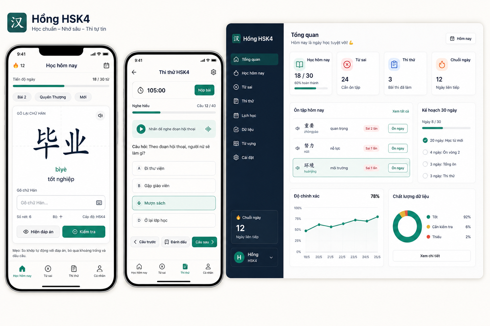
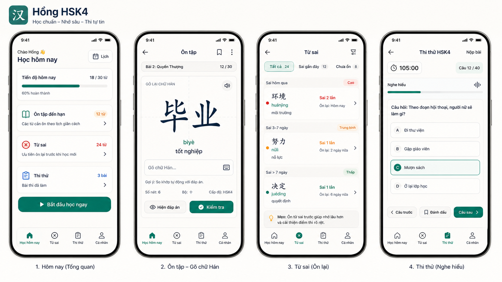

# UX Redesign Exploration - 2026-05-26

Goal: redesign Hong HSK4 Studio as a polished, mobile-first HSK4 learning PWA for Vietnamese learners, then translate the chosen direction into production HTML/CSS components.

## Product Posture

- Primary user: Hong, learning HSK4 mostly on a phone, sometimes desktop.
- Primary task: daily recall, mistake recovery, stroke practice, and mock exam readiness.
- UX principle: one main study action per screen, fast thumb navigation, calm visual rhythm, strong readability for Vietnamese, pinyin, and Hanzi.

## Design Direction

- Mobile first: bottom navigation for the most-used areas; no permanent left sidebar on phones.
- Tablet/desktop: navigation rail plus focused body, not a marketing dashboard.
- Study screen: recall card first, answer input second, stroke practice hidden or secondary until the learner chooses it.
- Mock exam: exam-mode chrome should feel quieter and stricter than study mode.
- Data/import pages: compact operational UI with status, import actions, and quality warnings.

## Visual Language

- Tone: focused, premium, calm, education-grade.
- Palette: ink navy, warm white, jade/teal accent, restrained red for errors, amber for review urgency.
- Typography: Vietnamese UI should use a clean sans; Hanzi should use a CJK-capable serif/sans fallback with large optical size and generous line height.
- Components: large tappable controls, segmented mode switch, bottom sheets/drawers on mobile, rail/table layout on desktop.

## Sources Consulted

- Material Design bottom navigation: mobile top-level destinations should be quick to switch in one tap, typically 3-5 destinations.
- Material Design navigation rail: use rail on medium/large displays for primary destinations.
- Material Design layout: predictable, consistent, responsive regions.
- web.dev PWA architecture: use app-shell thinking based on app constraints.
- Apple Human Interface Guidelines: navigation should feel familiar and not dominate content.
- W3C WCAG 2.2: account for target size and focus appearance.

## Deliverables In This Folder

- `prompts/ui-north-star.md`: image generation prompt for the ideal visual direction.
- `assets/`: selected generated mockups copied into the project.
- `notes/implementation-plan.md`: code translation plan after mockup selection.
- `notes/mockup-review-v1.md`: evaluation notes from the generated north-star boards.
- `references.md`: UX/UI references used for the exploration.

## Generated North-Star Boards

