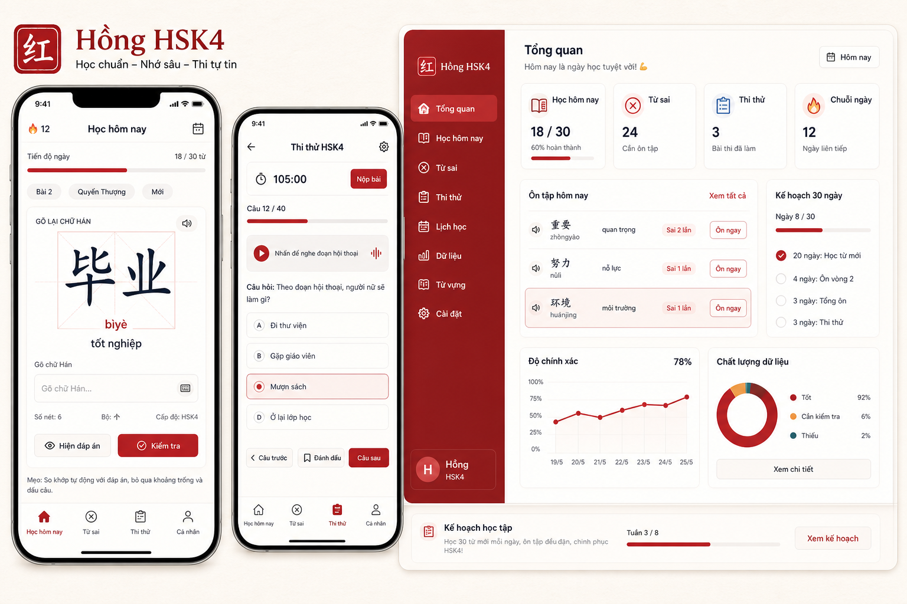
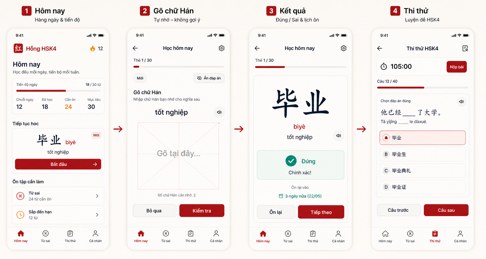
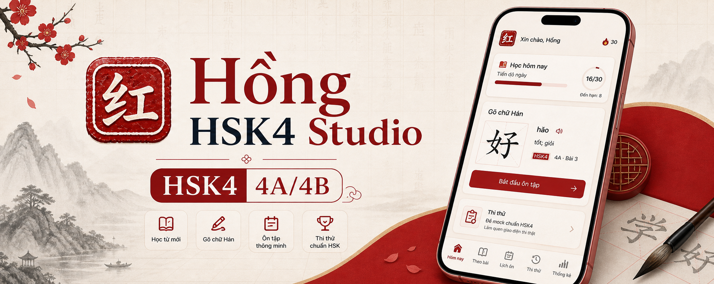
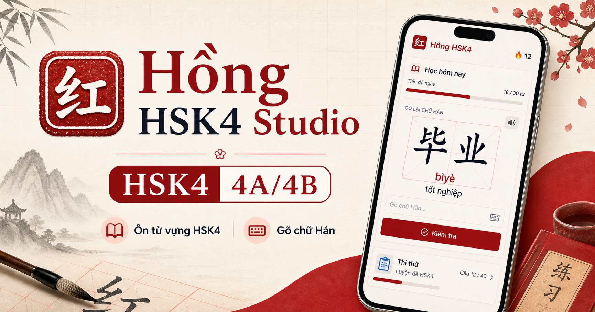
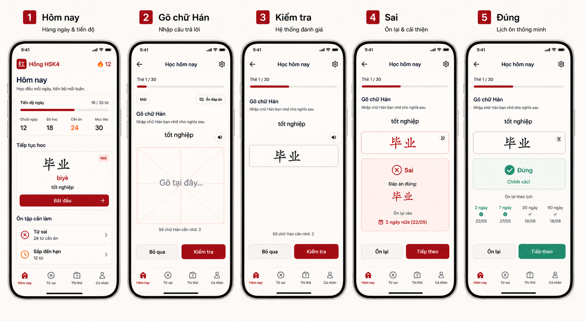
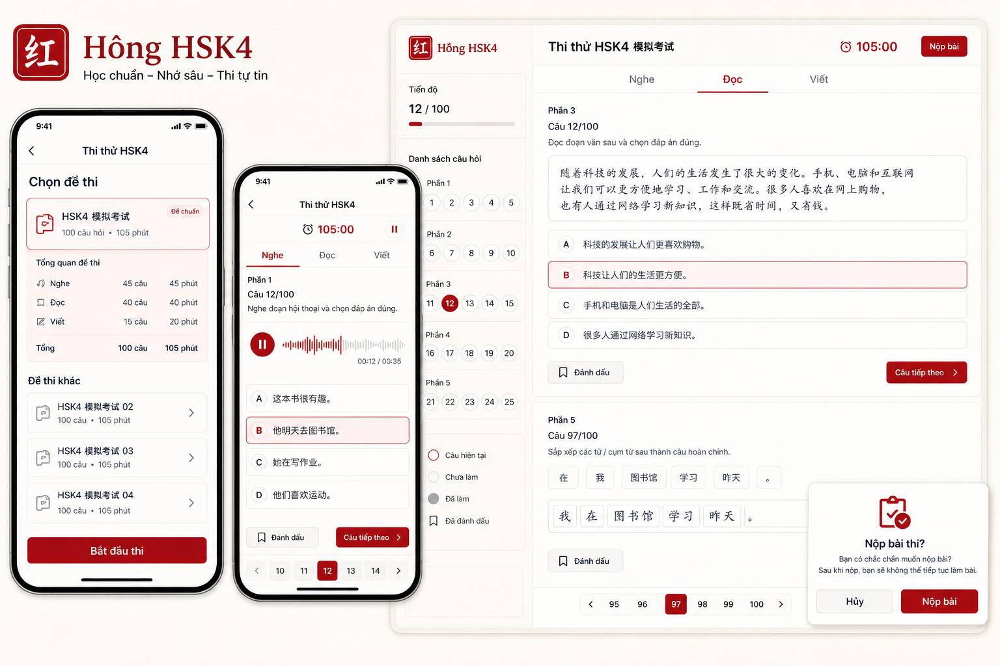
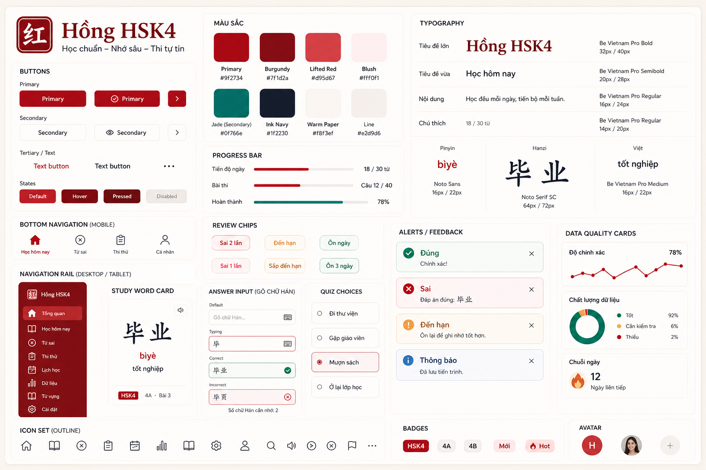
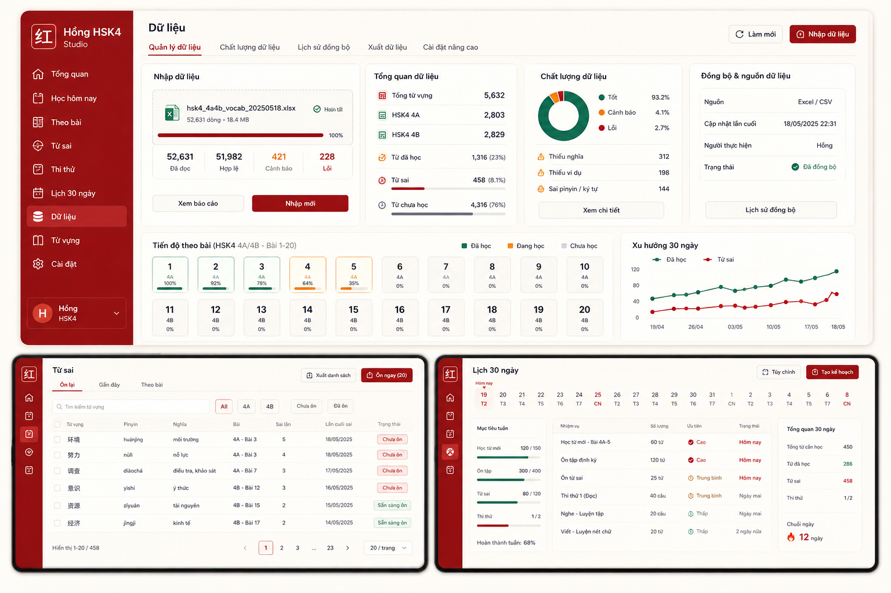

# UX Redesign Exploration - 2026-05-26

Goal: redesign Hồng HSK4 Studio as a polished, mobile-first HSK4 learning PWA for Vietnamese learners, then translate the chosen direction into production HTML/CSS components.

## Product Posture

- Primary user: Hồng, learning HSK4 mostly on a phone, sometimes desktop.
- Primary task: daily recall, mistake recovery, stroke practice, and mock exam readiness.
- UX principle: one main study action per screen, fast thumb navigation, calm visual rhythm, strong readability for Vietnamese, pinyin, and Hanzi.

## Design Direction

- Mobile first: bottom navigation for the most-used areas; no permanent left sidebar on phones.
- Tablet/desktop: navigation rail plus focused body, not a marketing dashboard.
- Study screen: recall card first, answer input second, stroke practice hidden or secondary until the learner chooses it.
- Mock exam: exam-mode chrome should feel quieter and stricter than study mode.
- Data/import pages: compact operational UI with status, import actions, and quality warnings.

## Visual Language

- Tone: focused, premium, calm, education-grade.
- Palette: Hồng/seal red is the primary brand color, supported by warm ivory paper, ink navy text, blush surfaces, and jade/teal only as a quiet secondary accent.
- Brand tokens to preserve from the app/logo: `#9f2734` brand red, `#7f1d2a` deep burgundy, `#d95d67` lifted red, `#fff0f1` blush, `#f8f3ef` warm paper, `#1f2230` ink, `#0f766e` jade secondary.
- Typography: Vietnamese UI should use a clean sans; Hanzi should use a CJK-capable serif/sans fallback with large optical size and generous line height.
- Components: large tappable controls, segmented mode switch, bottom sheets/drawers on mobile, rail/table layout on desktop.

## Sources Consulted

- Material Design bottom navigation: mobile top-level destinations should be quick to switch in one tap, typically 3-5 destinations.
- Material Design navigation rail: use rail on medium/large displays for primary destinations.
- Material Design layout: predictable, consistent, responsive regions.
- web.dev PWA architecture: use app-shell thinking based on app constraints.
- Apple Human Interface Guidelines: navigation should feel familiar and not dominate content.
- W3C WCAG 2.2: account for target size and focus appearance.

## Deliverables In This Folder

- `prompts/ui-north-star.md`: image generation prompt for the ideal visual direction.
- `assets/`: selected generated mockups copied into the project.
- `notes/implementation-plan.md`: code translation plan after mockup selection.
- `notes/mockup-review-v1.md`: evaluation notes from the generated north-star boards.
- `notes/mockup-review-v2-brand-red.md`: corrected review notes for the red-first brand direction.
- `notes/brand-palette-correction.md`: palette source of truth so future UI work does not drift back to teal-primary.
- `notes/resource-inventory.md`: how to use each generated design resource.
- `prompts/asset-pack.md`: prompt set used to generate the extra UX/UI resources.
- `references.md`: UX/UI references used for the exploration.

## Generated North-Star Boards

V1 boards are kept as layout references only. Their teal-led palette does not match the actual Hồng HSK4 logo.

V2 boards should use the corrected red-first brand direction.

## Design Resource Pack

These boards are implementation references, not source-of-truth text. Real UI copy must still come from the app code.

