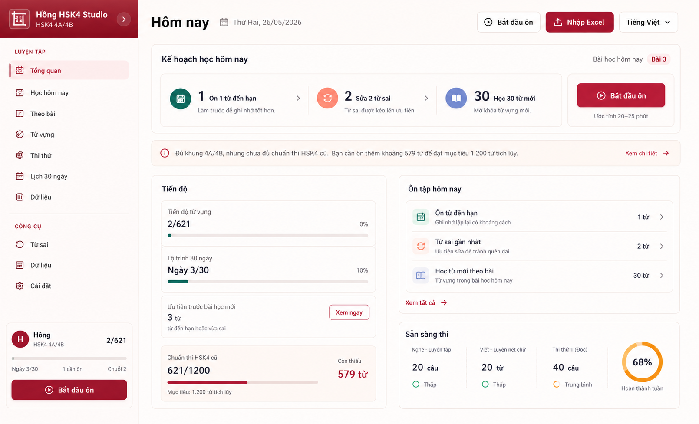
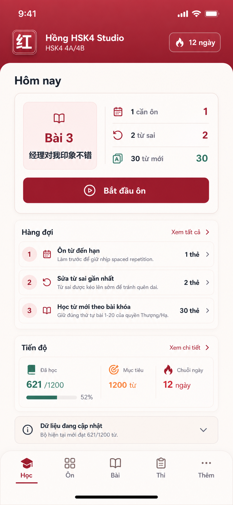

# Dashboard / Hôm Nay Lab

Ngày: 2026-05-26

## Câu Trả Lời Ngắn

`Tổng quan` hiện tại chính là route kỹ thuật `dashboard`, nhưng về UX không nên gọi nó là một bảng tổng quan theo nghĩa admin dashboard.

Trang này nên được thiết kế lại thành **Hôm nay**: màn hình quyết định việc học tiếp theo của Hồng trong ngày.

## Vấn Đề Của Bản Hiện Tại

- H1 `Tổng quan hôm nay` vẫn tạo cảm giác dashboard quản trị, không phải màn học.
- Cảnh báo dữ liệu đang chiếm vị trí quá cao, làm người học thấy app đang "báo lỗi" trước khi biết mình cần học gì.
- 6 metric card đầu trang tạo cảm giác KPI wall, không giúp Hồng bắt đầu học nhanh hơn.
- Mobile bị đẩy nội dung chính xuống thấp vì hành động và cảnh báo dàn quá nhiều.
- `Hàng đợi` và checklist học đúng về logic, nhưng chưa đủ nổi bật như primary daily workflow.

## North Star

Dashboard phải trả lời trong 3 giây:

1. Hôm nay học bài nào?
2. Cần ôn bao nhiêu từ trước khi học mới?
3. Nút bắt đầu ở đâu?
4. Có vấn đề dữ liệu nào thật sự chặn việc học không?

## Thiết Kế Đề Xuất

### Tên Trang

- Label chính: `Hôm nay`
- Có thể giữ route kỹ thuật: `dashboard`
- Sidebar desktop có thể giữ `Tổng quan` tạm thời trong giai đoạn chuyển tiếp, nhưng mobile nên ưu tiên `Ôn` hoặc `Hôm nay`.

### Thứ Tự Nội Dung

1. **Daily plan hero nhỏ**
   - Bài hiện tại.
   - Từ đến hạn.
   - Từ sai.
   - Từ mới.
   - CTA `Bắt đầu ôn`.

2. **Hàng đợi học**
   - Đến hạn.
   - Từ sai.
   - Từ mới theo bài khóa.
   - Mỗi hàng có count và hành động vào queue.

3. **Tiến độ**
   - Đã học / tổng.
   - Ngày trong lộ trình.
   - Chuỗi ngày.
   - Mức sẵn sàng thi.

4. **Cảnh báo dữ liệu**
   - Hiện thấp hơn.
   - Gọn như strip/collapsible.
   - Chỉ nổi bật khi thật sự chặn việc học.

5. **Sẵn sàng thi**
   - Đưa xuống dưới tiến độ.
   - Không dùng chart lớn nếu chưa có dữ liệu thi thử thật.

## Không Làm

- Không dùng 6 KPI card làm lớp nội dung đầu tiên.
- Không để cảnh báo vàng thành hero chính trừ khi dữ liệu thiếu nghiêm trọng.
- Không tạo dashboard kiểu admin.
- Không đặt quá nhiều số lớn cạnh nhau.
- Không dùng landing-page hero hay minh họa trang trí.

## Asset Lab

## Prompt Đã Dùng

Hai asset được tạo bằng built-in imagegen theo use case `ui-mockup`.

### Desktop

Tạo desktop dashboard concept cho `Hồng HSK4 Studio`, đổi `Tổng quan` thành command center `Hôm nay`, ưu tiên daily study plan, queue, progress, exam readiness; cảnh báo dữ liệu chỉ là strip nhỏ; palette soft red/burgundy/blush/paper/ink/teal; tránh KPI wall và marketing layout.

### Mobile

Tạo mobile-first dashboard concept cho `Hồng HSK4 Studio`, top brand header, bottom nav, main sheet; section đầu là action card `Hôm nay` với Bài 3, số từ cần ôn, từ sai, từ mới và CTA `Bắt đầu ôn`; data readiness nằm thấp hơn dạng compact/collapsible.

## Tiêu Chí Khi Triển Khai

- First viewport trên mobile phải thấy được CTA `Bắt đầu ôn`.
- Cảnh báo dữ liệu không được đẩy workflow học xuống quá sâu.
- Các metric phải phục vụ quyết định học, không chỉ để khoe số.
- Desktop và mobile phải cùng một IA, nhưng mobile được lược bớt detail.
- Tên hiển thị nên nghiêng về `Hôm nay`; `dashboard` chỉ là implementation detail.
